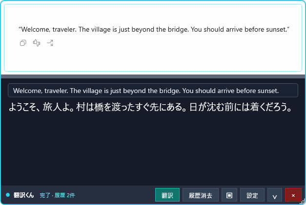

# 窓訳（Madoyaku）

Windows上のゲームやアプリに透明な枠を重ね、枠内の画像をOpenAI Responses APIへ送り、翻訳を下部に表示する小さなWPFアプリです。

個人開発のシンプルな試作品です。機能や使い勝手は開発途中です。



英文を囲んで翻訳した例です（画像は旧名称「翻訳くん」時点）。枠の下に読み取った原文と日本語訳を表示します。

## 現在できること

- 透明な翻訳範囲を移動・リサイズ
- ボタンまたは `Ctrl+Shift+T` で翻訳
- 長い原文・翻訳結果のスクロール表示と、ドラッグによる表示領域の高さ調整
- キャプチャ画像をOpenAIの画像対応モデルへ送信
- 基本プロンプト、ゲームのコンテキスト、モデル、翻訳先を編集
- 直近の原文・訳文を次回の文脈として利用
- ウィンドウ位置と翻訳設定を自動保存
- 配置アイコンから、位置・サイズ・結果欄の高さを名前付きで保存・呼び出し
- APIキーを任意でWindows資格情報マネージャーへ保存

## 起動

ソースからの起動・ビルドにはWindowsと.NET 10 SDKが必要です。翻訳には、自分のOpenAI APIキーと、画像入力に対応した利用可能なモデルを設定してください。API利用料が発生します。

PowerShellでこのフォルダを開きます。

```powershell
$env:OPENAI_API_KEY = "ここにAPIキー"
dotnet run
```

APIキーはアプリの「設定」から入力できます。「Windows資格情報マネージャーに保存する」を有効にすると、現在のWindowsユーザーの資格情報として保存されます。無効の場合はアプリを終了するまでだけ保持されます。どちらの場合も通常の設定JSONには保存されません。

環境変数とWindows資格情報の両方がある場合、`OPENAI_API_KEY` 環境変数を優先します。保存された資格情報はWindowsの「資格情報マネージャー」からも削除できます。登録名は `HonnyakuKun/OpenAI` です。

## 使い方

1. ゲームをウィンドウ表示またはボーダーレス表示にします。
2. 透明領域を翻訳したい台詞に重ねます。
3. `Ctrl+Shift+T` または「翻訳」を押します。
4. 訳文がウィンドウ下部へ表示されます。

よく使うウィンドウ配置は、ツールバーの配置アイコン（▣）から「現在の配置を保存…」を選んで名前を付けて保存できます。保存済みの配置を選ぶと、位置・サイズ・結果欄の高さをまとめて復元できます。

設定は `%LOCALAPPDATA%\HonnyakuKun\settings.json` に保存されます。キャプチャ画像と翻訳履歴はディスクへ保存しません。

設定の保存先とWindows資格情報の登録名には、既存データとの互換性のため旧名称 `HonnyakuKun` を使用しています。

## APIへ送信する情報

翻訳を実行すると、次の情報をOpenAI APIへ送信します。

- 翻訳範囲内のキャプチャ画像
- 基本プロンプト、翻訳先、ゲームのコンテキスト
- 設定した履歴数に応じた直近の原文・訳文（履歴数が0なら送信しません）

画像やコンテキストに、送信したくない情報が含まれていないことを確認してから翻訳してください。

## ビルド

```powershell
dotnet build
```

単体配布用の発行例:

```powershell
dotnet publish -c Release -r win-x64 --self-contained true -p:PublishSingleFile=true -o publish
```

## UI確認

WPFの見た目や操作を変更した場合は、PowerShellで次を実行します。

```powershell
.\scripts\Verify-Ui.ps1
```

このコマンドは確認専用の設定ディレクトリでアプリを起動し、実API通信なしで設定画面・ダミー翻訳・折りたたみ・履歴消去を操作して、実画面のPNGを `artifacts\ui-verification\<実行ID>` に保存します。`report.md` の全画像を確認した後、レポートに表示された `Complete-Verification.ps1` コマンドを実行すると、Releaseビルド、format検証、`git diff --check`、単体発行を行い、`publish\Madoyaku.exe` を更新します。確認モードは本番設定とWindows資格情報に触れず、APIキーを入力しません。

## 現時点の制限

- 排他的フルスクリーンや一部のアンチチート環境では、通常のオーバーレイや画面取得が動かない場合があります。
- OCRをローカル実行せず画像を直接送るため、翻訳ごとに画像入力のAPI利用料が発生します。
- 連続監視と翻訳ログ保存はまだ実装していません。

## ライセンス

このソフトウェアは[MIT License](LICENSE)で公開しています。
